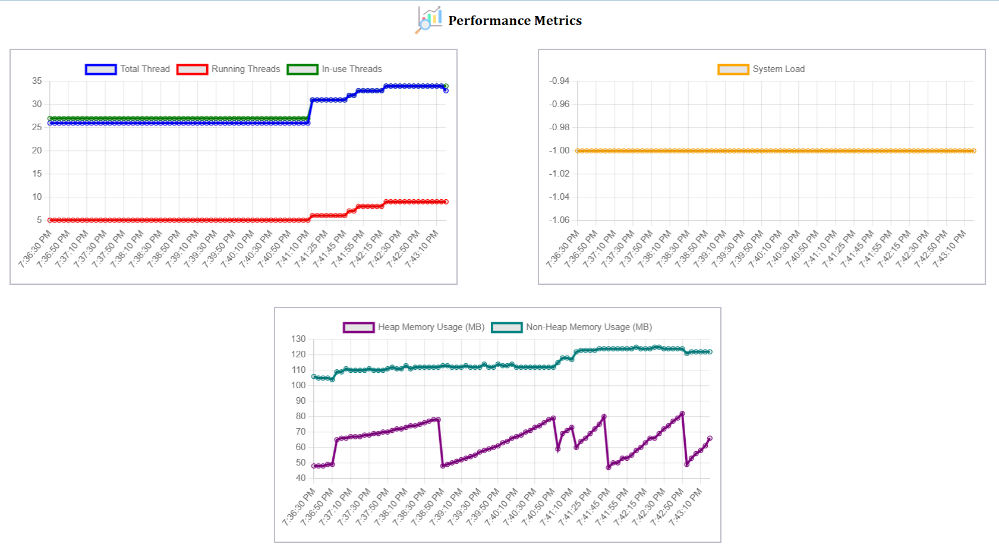
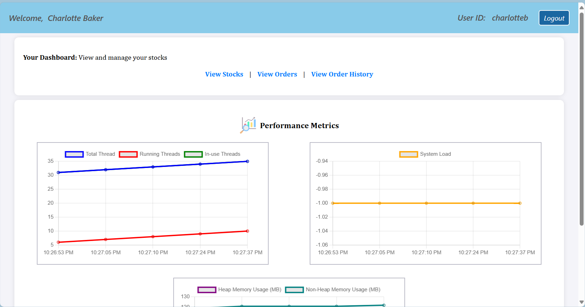
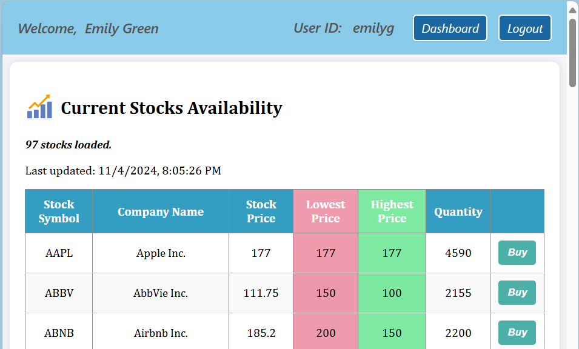
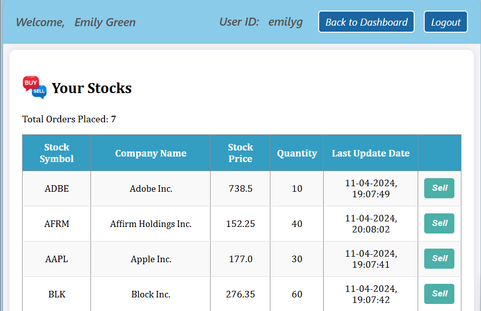
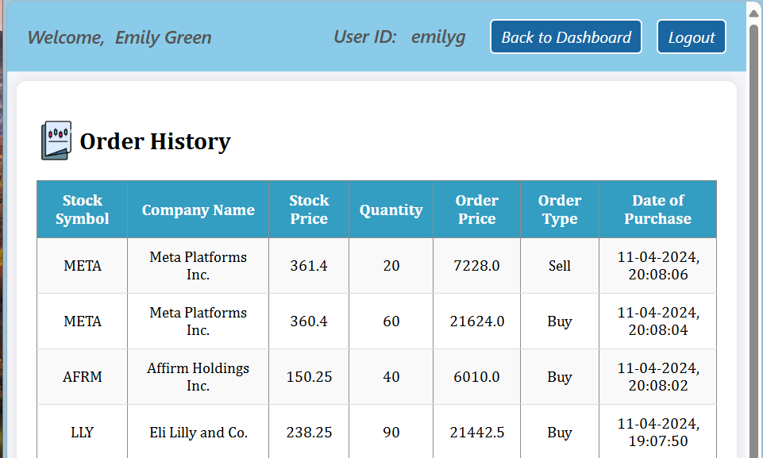
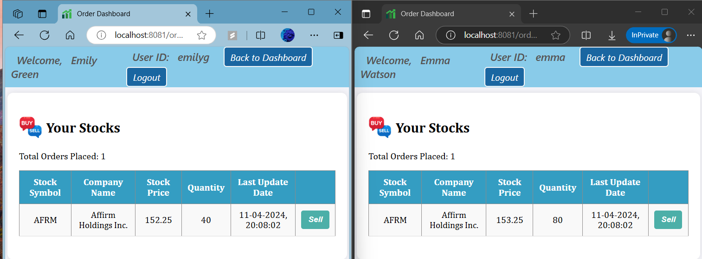

# Distributed Trading System

## Application Overview
This project implements a distributed stock trading system that allows multiple users to buy and sell stocks concurrently. It ensures that shared resources, such as stock quantities and prices, are handled efficiently using a microservices architecture, caching, and Java’s Concurrency API.

### Run the Application
To start the application, use the following command:

```
mvn spring-boot:run
```

### Navigate to:

http://localhost:8081/login


## Microservices Architecture
The system is designed using microservices architecture with the following services:

* Order Processing: Manages stock buy/sell operations.
* Stock Management: Maintains stock availability and pricing.
* User Management: Handles user registration, authentication, and profile management.

## Concurrency Management
We use Java's Concurrency API and thread pools to handle concurrent stock transactions and ensure thread safety during operations that modify shared resources like stock availability.

## Core Functionality

###  Microservices Architecture
**Order Processing Microservice:**
1. Implement the order processing logic where multiple users can buy or sell stocks concurrently. - DONE
2. Use `ExecutorService` to manage a pool of threads that handle these transactions. - DONE
3. Implement `synchronized threads` to safely update shared resources like stock availability. - DONE
4. Utilize thread pools to execute multiple stock trade requests in parallel, ensuring minimal latency. - DONE

*synchronized blocks* ensure that shared resources like stock availability and prices are safely updated by one thread at a time.


**Stock Management Microservice:**
1. Maintain real-time stock price data and update stock availability. - DONE
2. Synchronizes access to stock data to prevent inconsistent updates from multiple threads.  - DONE
3. Uses in-memory caching (e.g., Redis) to provide fast access to frequently requested stock data and reduce the load on the database. - DONE


**User Management Microservice:**
1. Handle user registration, authentication, and session management. - DONE


### Concurrency Management:

1. **Thread Pools:** The system uses `ExecutorService` to manage a pool of threads that handle stock buy/sell requests in parallel.
2. **Atomic Variables:** Thread-safe variables ensure that stock quantities and prices are updated without race conditions.
3. **Synchronized Blocks:** Critical sections are synchronized to ensure that only one thread can update a stock’s data at a time.

### Caching
1. **Stock Cache:** The stock data is cached to reduce load on the database. The cache is refreshed every 1 minute, or when stocks are modified during buy/sell operations.
2. **Order Cache:** Buy/sell orders are cached and updated in the database every minute to ensure efficient batch processing.

### Data Consistency:

The system uses **MySQL** to manage user and stock data. **Transactions and synchronized blocks** ensure that concurrent operations maintain consistency across all services.


### REST API Endpoints
**Order Processing:**

* GET /orders: Fetch stocks held by the user.
* POST /orders/sell: Place a sell order.
* GET /orders/{userId}: Get the number of stocks held by the user.
* GET /{userID}/history: Retrieve a user’s order history.

**Stock Management:**

* GET /stocks: Fetch the list of all available stocks.
* POST /stocks/buy: Place a buy order.

**User Management:**

* GET/POST /register: User registration.
* GET/POST /login: User login.
* GET /user: Fetch user profile.
* GET /logout: Logout of current session.


### UI and Frotnend

The frontend uses **Thymeleaf** templates integrated with **Spring Boot** for dynamic content rendering.

**HTML Pages:**

* **login.html:** User login page.
* **register.html:** User registration.
* **userDashboard.html:** Displays user-specific data after login.
* **stock_dashboard.html:** Displays available stocks for buying/selling.
* **orderProcessing.html:** Allows users to place buy/sell orders.


Display real-time metrics such as execution time, active threads, and the number of processed transactions. - **TODO**

## Deploy the Application
**Dockerize** the Application: Create Docker images for each microservice and deploy them using Docker Compose or Kubernetes.
**AWS Deployment:** Use AWS services like ECS (Elastic Container Service) for deploying the containerized application. Implement AWS Lambda functions for serverless components if necessary.


## Application Architecture

#### Controllers:
These act as the entry points for various HTTP requests and communicate with services to perform business logic. 
1. **OrderController:** Handles operations like buying and selling stocks via REST endpoints.
2. **StockController:** Provides information about available stocks, such as current stock prices.
3. **UserController:** Manages user-related operations like login, registration, and retrieving user-specific data.

#### Models:
These represent the entities or data structures that the system manipulates. 
1. **OrderModel:**  Represents the order details, such as the type of transaction (buy/sell), stock symbol, and the quantity of stocks.
2. **StockModel:**  Contains information about individual stocks, such as stock symbol, price, and availability.
3. **UserModel:** Stores user data such as username, password, and account information.

#### Services:
These contain the core business logic. Controllers delegate requests to services to handle the actual work:

1. **OrderService:** Processes buy/sell operations and ensures thread-safe updates to stocks.
2. **StockService:** Manages real-time updates to stock data and responds to requests for current stock prices, including caching.
3. **UserService:** Handles user registration, login, and authentication logic.


*Trading System Logic:*
The TradingSystem class likely acts as a utility or central service to coordinate multiple services. It could handle tasks like validating an order, updating user balances, or managing stock data across multiple services.


### Total lines of code:

946


## Real-Time Performance Monitoring
The system provides live performance monitoring through SSE (Server-Sent Events) for updating key metrics on the user dashboard. Metrics such as active threads, CPU load, and memory usage are updated every 5 minutes, or instantly whenever a new order is placed. This setup allows for real-time monitoring, offering users insights into application performance, which is crucial for high-frequency trading scenarios.

To achieve detailed performance metrics for the stock trading application, I have focused on gathering the following metrics:

1. Thread Pool Metrics
* Total number of threads in your application.
* Active threads specific to the order processing.
* Queue size (if using a thread pool with a queue).
* Threads waiting for tasks.
* Rejected tasks count.

2. CPU Metrics
* CPU load for the JVM.
* CPU load for the system.

3. Memory Usage
* JVM heap memory usage.
* Non-heap memory usage.

<!-- 4. Throughput and Latency
* Number of orders processed per second (throughput).
* Time taken to complete an order (latency). -->




## Testing
The application underwent rigorous testing, including:

* **Unit Testing** to verify individual functions for each microservice.
* **Integration Testing** to ensure seamless data flow and operation across the entire microservices setup.
* **Performance Testing** to gauge the application's performance under high-concurrency scenarios. These tests were performed to confirm the stability of the order processing, stock updates, and real-time metrics components under a heavy load.

### Further testing:

1. Load Testing, using tools like JMeter or Gatling for more comprehensive load testing beyond HighConcurrencyPerformanceTest test.
2. Mocking External Dependencies using libraries like Mockito for mocking gRPC interactions in isolation to ensure the tests are focused and reliable.
3. CI/CD Integration: Integrate tests into a continuous integration pipeline (e.g., GitHub Actions, Jenkins) to ensure automated testing with every code change.
4. Testing API endpoints using REST-assured (Java Library)
5. Input Validation: Test for missing parameters, invalid data formats, and edge cases.
6. Error Handling: Ensure appropriate HTTP status codes (e.g., 400 for bad requests, 404 for not found, 500 for server errors).


## ScreenShots

Check out the working of the system here:

[Demo Video](Screenshots_Videos\Distributed_Trading_System2.mp4)


1. **User Dashboard:**


2. **Stocks Availability**


3. **Stocks currently in the user's account**



4. **History of the stocks bought or sold by user**


5. **Multithreading: Orders placed at the same time**

